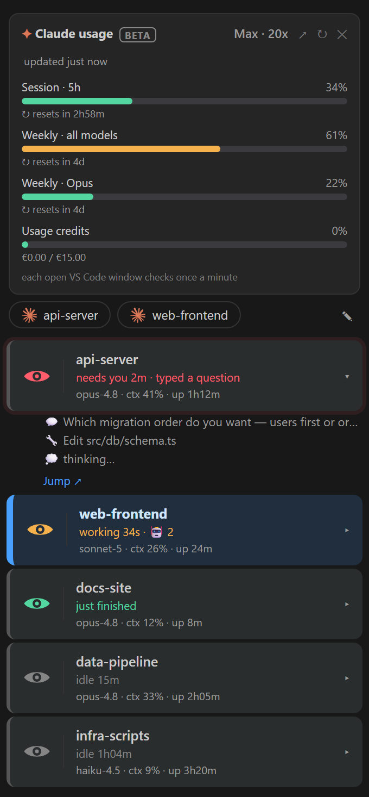

# Overlord 👁️

A live board of your [Claude Code](https://claude.com/claude-code) sessions, right inside VS Code. One colored eye per session so you always know which one needs you, which is working, and which just finished, plus one-click jump to the exact terminal. Works on Windows and macOS.

> **Beta.** An early release, live on the VS Code Marketplace and auto-updating. Expect a few rough edges and frequent improvements. Feedback very welcome 🙏



## Why Overlord?

**Isn't this just Agent View?** Overlord is *built on* Claude Code's Agent View, and adds what it's missing for people living in the terminal:

- **Catches what Agent View calls "idle."** A session that typed you a question or said "say go and I'll…" shows as plain idle in Agent View. Overlord flags it red: *needs you*.
- **Visible when VS Code isn't.** Status-bar counter, activity-bar badge, sound, and pop-ups, so you're alerted even with the panel closed or VS Code buried.
- **One-click jump** to the exact terminal tab.

*Built for Claude Code running in your VS Code terminal, not the Claude chat extension.*

## What it does

- **Eye icon** in the Activity Bar → opens the session board.
- **One eye per session**, colored by status:
  - 🔴 **Needs you** (pulsing) · 🟡 **Working** · 🟢 **Done** (brief) · ⚪ **Idle**
- **Status-bar counter** — `👁 🔴2 🟡3 🟢1`, turns red when a session needs you. Click to open the board.
- **Count badge** on the Activity Bar icon — how many sessions are waiting on you, even with the panel closed.
- **Pop-up + a soft notification sound** when a session needs your answer, each with a **Jump to it** button.
- **Click any eye** → jumps straight to that session's terminal (labelled with the terminal's tab name).
- **Expandable cards** (v2.1) — click a card to expand it (▸/▾ chevron): up to 7 recent activity lines with icons (🔧 Bash, ✏️ edits, 💭 thinking), a 💬 preview of the session's latest message, and a state-aware action link (*Answer now / Watch / Continue*). Cards show `state time · model · ctx tokens · % used · uptime`.
- **New session launcher** (v2.1) — a button in the panel and status bar: pick a folder, and a fresh Claude Code session opens as an **editor-area terminal**. The command it runs is configurable (`overlord.newSessionCommand`, default `claude`).

## How it works

Overlord is built on Claude Code's own **Agent View**. It polls

```
claude agents --json
```

every couple of seconds and paints an eye per session. There are **no hooks and no state files** — the status comes straight from Claude Code's session supervisor.

**Status mapping** (`status` field from `claude agents --json`):

| Native status | Eye | Notes |
|---|---|---|
| `waiting` | 🔴 Needs you | a permission prompt or an interactive question; subtitle shows `waitingFor` |
| `busy` | 🟡 Working | |
| `idle` | ⚪ Idle | finished, nothing pending |
| _(derived)_ | 🟢 Done | brief green flash when a session goes `busy → idle`; see `overlord.doneFlashSeconds` |

**Beyond native — turns that quietly need you.** Agent View reports `idle` both when a session *finishes* and when it *ends its turn waiting on you* — it can't tell them apart. Overlord adds one check: for `idle` sessions it peeks the transcript's last message and, if the session is actually waiting on you, shows 🔴 instead of grey. It catches two shapes `claude agents` alone misses:

- a **genuine typed question** → subtitle **"needs you · typed a question"**. The check ignores trailing asides, so a real question followed by a parenthetical or an option list still counts, while a rhetorical question the assistant answers itself does not.
- an **approval / go-ahead request** with no question mark — "say go and I'll…", "give me the green light", "let me know which…" → subtitle **"needs you · awaiting your reply"**.

This is the thing Overlord catches that `claude agents` alone does not. Toggle with `overlord.detectTypedQuestions` (default on).

Each record also carries the live `claude` process `pid`. Overlord walks the process tree from it to label each eye with its **VS Code terminal tab** and to **jump** to that terminal on click.

**Cost:** each poll spawns the CLI (~0.5s). The interval is configurable (`overlord.pollMs`, default 2500 ms); lower values feel snappier but use more CPU. This is a deliberate trade for zero setup — no hooks to install.

## Install

**From the VS Code Marketplace** (recommended; installs update automatically). Pick whichever is easiest:

- **Page:** open the [Marketplace listing](https://marketplace.visualstudio.com/items?itemName=jana81000.overlord-vscode) and click **Install**.
- **In VS Code:** press `Ctrl+P`, then run `ext install jana81000.overlord-vscode`.
- **In a terminal:** run `code --install-extension jana81000.overlord-vscode`.

Then reload VS Code.

Requires the [Claude Code CLI](https://claude.com/claude-code) on your `PATH` (the `agents` command needs CLI v2.1.x or newer). If the extension host can't find `claude`, set `overlord.claudePath` to the full path to the binary. See [INSTALL.md](INSTALL.md).

## Settings

| Setting | Default | What it does |
|---|---|---|
| `overlord.claudePath` | `claude` | command/path used to run the CLI |
| `overlord.pollMs` | `2500` | how often to poll `claude agents --json` (ms) |
| `overlord.sound` | `true` | soft notification sound on "needs you" |
| `overlord.notifications` | `true` | pop-up alerts |
| `overlord.doneFlashSeconds` | `12` | how long the green "done" flash lasts |
| `overlord.detectTypedQuestions` | `true` | flag idle sessions whose last message is a typed question or an approval/go-ahead request as "needs you" |
| `overlord.device.enabled` | `false` | **opt-in.** mirror the board to an Overlord hardware screen on your LAN (starts a local server + discovery beacon). Off unless you have the companion screen. |
| `overlord.device.port` | `7331` | TCP port the hardware screen connects to |

Toggle sound anytime: **Overlord: Toggle Sound**. To use your own sound, replace `media/notify.wav` with any `.wav` (regenerate with `python make_sounds.py`).

## Privacy

Everything is local. Overlord runs `claude agents --json` on your machine and reads the result; no network calls, no telemetry. The data is only session ids, working directories, statuses, and process ids on your own machine.

## Development

- `agents.js` — pure, dependency-free mapping from `claude agents --json` records to the display model. Unit-tested in `test-agents.js` (`node test-agents.js`).
- `extension.js` — the VS Code shell: polling, the webview, process-tree resolution, notifications, and sound.

## License

MIT — see [LICENSE](LICENSE).
